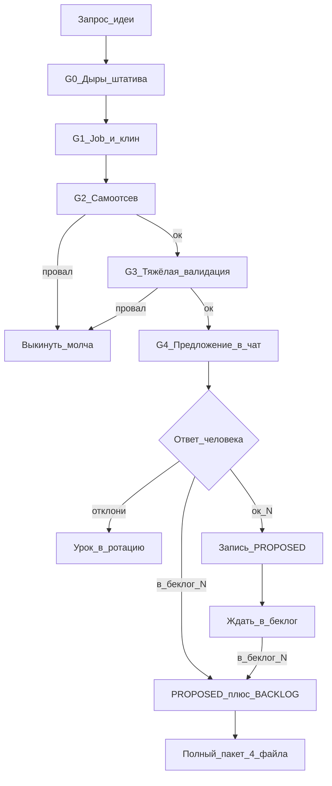

# Схема: генерация → валидация → предложение идей Bitrix24 Marketplace

Платформа: **только облако**. Без внешних интеграций и отраслевых вертикалей.  
Почасовой автопоток **выключен**. Работа — по запросу.

## Решения (зафиксировано)

| Решение | Выбор |
|--------|--------|
| Гейт человека | **A** — в чат сначала; в `PROPOSED` / `BACKLOG` только после `ок` / `в беклог N` |
| Глубина валидации | **Тяжёлая** — до показа пользователю: чеклист + скоринг + разбор Маркета и штатива (черновик уровня `__competitors`) |
| Объём за раз | **1–2** кандидата (не пятёрка радаров) |

---

## G1 — Генерация (сначала работа, потом API)

### Критерий силы (все три + тест лени)

1. **Сцена** — конкретный человек в конкретный момент; боль про **деньги / план / крупный слив / войну отделов**, не про «аккуратность CRM».
2. **Платёжный тест** — ценность одной фразой без аналитического жаргона; фраза звучит как ставка («Sorвём план», «сольём корпоратив», «бюджет в пустоту»), не как удобство.
3. **Зазор vs коробка** — не закрывается экраном / роботом / БП / фильтром / типовым отчётом / чатом / Excel.
4. **Тест ленивого менеджера** — неделю никто не заполняет ничего нового → польза из уже лежащих данных CRM всё ещё есть. Иначе дисквал.
5. **Не гигиена:** автосдвиг дат, развод слотов, подстановка строк, «пачка просроченных дел» — сами по себе недостаточны, пока нет явной денежной ставки.

**Цель продукта:** снять рутину **в контексте настоящей боли** (план, касса, крупный клиент, маркетинг↔продажи), а не улучшить порядок в полях ради порядка.

### Источники сюжета (по приоритету)

1. **Недоделанный штатив Bitrix24** — фича есть наполовину; job обрывается (см. **G0** ниже). Главный источник с 2026-09-23.
2. Дыра Маркета как сигнал той же недоделки (бестселлеры = люди платят за то, чего нет в коробке).
3. Дожим `BACKLOG` / `в беклог N`.
4. Ритуал роли — только как проверка, что дыра штатива реально бьёт в деньги/план.
5. API — опора реализуемости **в конце**.

### Шаги генерации

0. Пройти **G0** (майнинг дыр штатива) → 3–7 гипотез «недоделано».
1. Для каждой: роль + ставка (деньги/план/слив/война отделов).
2. Job: «когда … хочу … чтобы …».
3. Карта «как сейчас в B24» (экран / робот / БП / отчёт). Если терпимо — **стоп**.
4. Клин приложения: добивает обрыв штатива, желательно автопилотом из уже лежащих данных.
5. Набросать MVP и placement/API как гипотезу → G2 → G3.

Черновики до ответа человека **не писать** в `PROPOSED.md`.

### ICP

Продажи, маркетинг, аккаунт, поддержка, РОП/комдир.  
Не WIP / оценки часов / теплокарты дедлайнов / скрам‑приёмка.

---

## G0 — Как агент находит «недоделанное» в Битрикс24

Идея не «придумать ритуал», а **добить обрыв**, который уже наметил сам Bitrix.

### Что считать недоделкой (паттерны)

| Паттерн | Смысл | Пример направления поиска |
|--------|--------|---------------------------|
| A→B обрыв | Фича A есть, следующий логичный шаг B — руками / никак | Смена ответственного есть → открытые дела сами не всегда уезжают штатно без робота; OL ведёт на ответственного CRM → участники чата сделки не всегда = владелец |
| Одна сущность / не связка | Умеем по одной карточке, не умеем по графу | Дедуп при создании есть → «повтор после LOSS × источник» нет |
| Константа вместо факта | Робот/настройка с фиксированным N | «Повтор через 180 дней» есть → цикл от факта покупок SKU×компания нет |
| Есть API / нет продукта | REST/placement позволяют, UI job не собран | `imopenlines.crm.chat.user.add` есть → готового «всегда держать владельца сделки в чате» как продукта нет |
| Бестселлер Маркета | Платят за обход коробки | Категории с кучей installs вокруг одной боли = сильный сигнал дыры |

Не брать в работу: баги/тормоза/телефония «глючит», мобилка, тарификация Маркета, «внедрение кривое» — это не продукт приложения в наших доменах или вне scope.

### Где агент это копает (порядок)

1. **Helpdesk Bitrix24** — статьи по CRM/роботам/OL/делам/товарам: где пишут «нужно вручную», «отдельно передать», «настройте робота», цепочка из 2–3 роботов на один job.
2. **Семья фич** — открыть соседние возможности (повторные продажи, регулярные сделки, план продаж, смена ответственного, дела, товары) и спросить: *какой job пользователь ожидает сразу после этой кнопки и чего нет?*
3. **Маркет (сигнал, не копирка)** — топ приложений в CRM/аналитика/чаты: что обещают = часто недоделка коробки; выписать job, не клонировать UI.
4. **Отзывы/обзоры** (осторожно) — только формулировки «не хватает X в CRM», отфильтровать баги и «плохо внедрили».
5. **API/placements docs** — методы без очевидного штатного экрана под цельный job.

На выходе G0 — таблица гипотез:

`дыра | что уже есть в штативе | где обрывается | ставка (деньги/план/…) | черновой клин`

Дальше каждая гипотеза идёт в G2/G3. В чат — только пережившие валидацию.

### Как валидировать недоделку (связка G2+G3)

Для каждой гипотезы агент обязан явно ответить:

1. **Штатив-доказательство:** цитата/ссылка helpdesk или описание экрана — *что есть* и *чего нет* на следующем шаге job.
2. **Роботизация:** собирается ли job одним роботом/БП без костылей? Да → дисквал.
3. **Маркет:** 5–10 приложений; если ≥3 сильных уже закрывают тот же job — либо узкий клин «лучше/проще», либо дисквал.
4. **Ставка:** без приложения через 1–4 недели — план/касса/крупный клиент/война отделов? Нет → дисквал (гигиена).
5. **Ленивый менеджер:** данные уже в CRM/событиях? Да.
6. **Скоринг** A≥4, B≥3, C≥3.

В предложении в чат (G4) блок валидации всегда включает: **«Недоделка штатива: … / Доказательство: … / Почему не робот: … / Маркет: …»**.

---

## G2 — Самоотсев (быстрый дисквал)

Любой «да» = идея умирает **до** Маркета и **до** чата:

1. Робот/БП 1:1 (триггер → дело/уведомление/поле).
2. Штатный дедуп.
3. Голый period KPI / типовой отчёт без новой работы в ритуале.
4. Пустое поле → список → алерт.
5. «Нет следующего дела» / дайджест просрочек.
6. Фейковый chat handoff / чтение текста сообщений.
7. IT‑продуктивность без покупателя вне IT.
8. Мельница детекторов: серии правок / path / fingerprint / «источник × метрика» / коллизия графа без действия системы.
9. Платёжный тест провален / боль «надуманная» (не болит без новой привычки).
10. Клон сюжета из последних ~30 номеров `PROPOSED`.
11. **Дисциплинозависимость:** ценность = 0, если менеджер не кормит приложение руками каждый день (закрепы, теги, брифы, реестры, «подтверди приёмку» как единственный вход). Нужна автоматизация рутины из уже лежащих данных, человек — редкое подтверждение, не ежедневный ввод.
12. **Гигиена CRM вместо боли:** чинит даты/дела/строки/слоты календаря, но не бьёт в деньги, план, крупный слив или войну отделов. Тест: «если это не сделать — что больно через неделю: касса, план, увольнение клиента, конфликт маркетинга?» Если ответ «чуть аккуратнее CRM» — дисквал.

Уроки: **114–118**; **269–273**; **285/286/288**; радары **274–313**; дисциплина **314–318** (ручные ритуалы); авто‑гигиена **314–318b** (сдвиг CLOSEDATE, развод дел, паковка просрочки, подстановка товаров, цикл SKU) — слабо, мимо боли.

---

## G3 — Тяжёлая валидация (обязательна до показа в чат)

Делать **только** для кандидатов, переживших G2. На один запрос — максимум **1–2** таких кандидата.

### G3.1 Скоринг (1–5)

- **A** рынок/ценность (частота, платёжность, дифференциация; штраф за слабый зазор).
- **B** реализуемость (объекты CRM/Tasks/IM, данные, права).
- **C** техсложность MVP ≤1–2 недели (1 killer‑экран).

Порог в чат: **A ≥ 4**, **B ≥ 3**, **C ≥ 3**. Иначе — выкинуть или упростить и пересчитать.

### G3.2 Штатив Bitrix24

Явно проверить и записать в черновик:

- роботы / триггеры / БП;
- фильтры и штатные отчёты CRM;
- типовые экраны (дела, стадии, товары, чаты).

Если находится терпимый обход — **дисквал** (не предлагать).

### G3.3 Маркет (уровень `__competitors`)

Для каждого кандидата до чата:

- 10–15 поисковых формулировок;
- 5–10 приложений‑конкурентов: обещание, механика, сигналы отзывов/установок если видны, права, пробелы;
- вывод: слабые места рынка + **чем мы не дублируем коробку и конкурентов**.

Черновик держать у агента (в ответе кратко + при `ок`/`в беклог` сохранить как `NN_<slug>__competitors.md`).  
До команды человека **не коммитить** файлы идеи.

### G3.4 Красные флаги реализации

Внешние интеграции, отрасль, тяжёлый realtime/боты, TTV > 10 минут, «админ‑всё», комбайн из многих вкладок в MVP → дисквал.

---

## G4 — Предложение в чат (гейд A)

Показывать только то, что прошло G2+G3.

### Формат в чате

1. Название (русский, без жаргона)
2. Сцена / боль / цена
3. Что делает (работа, не лог)
4. Для кого
5. Эффект
6. MVP (3–5 фич)
7. Чем НЕ штатив / робот / БП / отчёт
8. Как сейчас обходят
9. Валидация кратко: **недоделка штатива + доказательство** · почему не робот · A/B/C · 2–3 конкурента/дыры Маркета
10. Риски
11. Команды: `ок N` · `в беклог N` · `отклони N`

Нумерацию `N` брать как **следующий свободный** из `PROPOSED.md`, но **не занимать** номер в файле, пока нет `ок` / `в беклог`.  
Если параллельно несколько кандидатов — резервировать номера только в тексте чата и записать разом после ответа.

### Команды человека

| Команда | Действие |
|---------|----------|
| `ок N` | Записать карточку в `PROPOSED.md` + ротацию ритуалов; полный пакет **не** начинать |
| `в беклог N` | `PROPOSED` + `BACKLOG` + сразу полный пакет из 4 файлов + `INDEX.md` |
| `отклони N` | В репо не писать; одну строку в ротацию: ритуал + причина отказа |
| `доработай N: …` | Правки → снова G2/G3 по месту → повторный показ в чат |

---

## G5 — После согласия: артефакты в репо

### После `ок N`

- Карточка в [`PROPOSED.md`](PROPOSED.md) (полный формат + статус `предложено`, скоринг, ссылка что конкуренты будут при беклоге).
- Обновить `## Ротация ритуалов`.
- Commit/push.

### После `в беклог N`

1. То же, что `ок`, плюс очередь и карточка в [`BACKLOG.md`](BACKLOG.md), статус `в беклоге`.
2. Полный пакет (конвейер ≤5 часов на приложение):
   - `NN_<slug>.md` — суть, УТП, ICP;
   - `NN_<slug>__competitors.md` — из G3.3;
   - `NN_<slug>__mvp_release_market.md` — УТП, MVP, релиз 1–2 недели, текст Маркета;
   - `NN_<slug>__screens_security_faq.md` — скриншоты, права, FAQ;
   - обновить [`INDEX.md`](INDEX.md).
3. Commit/push.

### Механики (предпочтения)

Действие в карточке, мастер ритуала, помощник, экран смысла для планёрки.  
Детектор/радар: **макс. 1** на пачку, лучше **0**.

### Ротация ритуалов

В `PROPOSED.md` блок `## Ротация ритуалов`. Не повторять тот же ритуал подряд.  
API‑таблица A–J — справочник в конце файла skill/метода, не барабан генерации.

| Код | Угол | Зачем |
|-----|------|--------|
| A | События | журналы |
| B | История стадий | пути |
| C | Связи | deal↔contact↔activity |
| D | Агрегаты | только внутри живого job |
| E | Оргструктура | маршрутизация |
| F | Placements | действие в карточке |
| G | IM‑метаданные | без текста |
| H | Чеклисты/время | осторожно → IT |
| I | Дубли | почти всегда запрет |
| J | Товарные строки | состав КП |

---

## Хороший зазор (напоминание)

- Меняет исход ритуала за ~1 минуту **или снимает рутину вовсе**.
- Не сводится к уведомлению робота, фильтру «как есть» или новой форме на каждый день.
- Работает на данных, которые менеджер **уже** оставляет в B24 (стадии, дела, товары, смены ответственного, даты).
- Покупатель объяснит коллеге своими словами.
