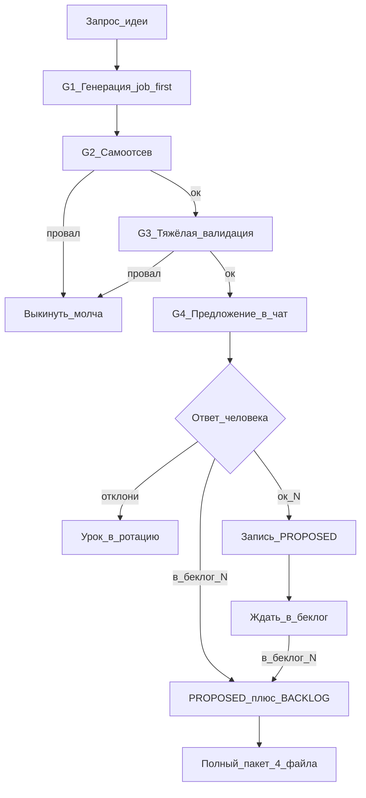

# Схема: генерация → валидация → предложение идей Bitrix24 Marketplace

Платформа: **только облако**. Без внешних интеграций и отраслевых вертикалей.  
Почасовой автопоток **выключен**. Работа — по запросу.

## Решения (зафиксировано)

| Решение | Выбор |
|--------|--------|
| Гейт человека | **A** — в чат сначала; в `PROPOSED` / `BACKLOG` только после `ок` / `в беклог N` |
| Глубина валидации | **Тяжёлая** — до показа пользователю: чеклист + скоринг + разбор Маркета и штатива (черновик уровня `__competitors`) |
| Объём за раз | **1–2** кандидата (не пятёрка радаров) |

---

## G1 — Генерация (сначала работа, потом API)

### Критерий силы (все три + тест лени)

1. **Сцена** — конкретный человек в конкретный момент; боль узнаваема без «заведите новую привычку».
2. **Платёжный тест** — ценность одной фразой без аналитического жаргона.
3. **Зазор vs коробка** — не закрывается экраном / роботом / БП / фильтром / типовым отчётом / чатом / Excel.
4. **Тест ленивого менеджера** — неделю никто не заполняет ничего нового → польза из уже лежащих данных CRM всё ещё есть. Иначе дисквал.

**Цель продукта:** снимать рутину (собрать / создать / перенести / подготовить следующий шаг из уже произошедшего), а не добавлять ежедневные формы.

### Источники сюжета (по приоритету)

1. Ритуал роли (планёрка, созвон, передача сделки, маркетинг↔продажи, …).
2. Дыра Маркета (смотреть конкурентов уже на G3, но сюжет можно взять из известной дыры).
3. Дожим `BACKLOG` / `в беклог N`.
4. API — только опора реализуемости **в конце**.

### Шаги генерации

1. Выбрать **роль + ритуал** (не код A–J).
2. Job: «когда … хочу … чтобы …».
3. Как сейчас в B24. Если терпимо — **стоп**, не тащить в валидацию.
4. Клин: одно действие или один экран, меняющий ритуал.
5. Набросать MVP и placement/API как гипотезу.

Черновики до ответа человека **не писать** в `PROPOSED.md`.

### ICP

Продажи, маркетинг, аккаунт, поддержка, РОП/комдир.  
Не WIP / оценки часов / теплокарты дедлайнов / скрам‑приёмка.

---

## G2 — Самоотсев (быстрый дисквал)

Любой «да» = идея умирает **до** Маркета и **до** чата:

1. Робот/БП 1:1 (триггер → дело/уведомление/поле).
2. Штатный дедуп.
3. Голый period KPI / типовой отчёт без новой работы в ритуале.
4. Пустое поле → список → алерт.
5. «Нет следующего дела» / дайджест просрочек.
6. Фейковый chat handoff / чтение текста сообщений.
7. IT‑продуктивность без покупателя вне IT.
8. Мельница детекторов: серии правок / path / fingerprint / «источник × метрика» / коллизия графа без действия системы.
9. Платёжный тест провален / боль «надуманная» (не болит без новой привычки).
10. Клон сюжета из последних ~30 номеров `PROPOSED`.
11. **Дисциплинозависимость:** ценность = 0, если менеджер не кормит приложение руками каждый день (закрепы, теги, брифы, реестры, «подтверди приёмку» как единственный вход). Нужна автоматизация рутины из уже лежащих данных, человек — редкое подтверждение, не ежедневный ввод.

Уроки: **114, 115, 117, 118**; **269–273**; **285/286/288**; радары **274–313**; дисциплинозависимые кандидаты **314–318** (закрепы планёрки, приёмка брифа, ручные решения/обещания/теги).

---

## G3 — Тяжёлая валидация (обязательна до показа в чат)

Делать **только** для кандидатов, переживших G2. На один запрос — максимум **1–2** таких кандидата.

### G3.1 Скоринг (1–5)

- **A** рынок/ценность (частота, платёжность, дифференциация; штраф за слабый зазор).
- **B** реализуемость (объекты CRM/Tasks/IM, данные, права).
- **C** техсложность MVP ≤1–2 недели (1 killer‑экран).

Порог в чат: **A ≥ 4**, **B ≥ 3**, **C ≥ 3**. Иначе — выкинуть или упростить и пересчитать.

### G3.2 Штатив Bitrix24

Явно проверить и записать в черновик:

- роботы / триггеры / БП;
- фильтры и штатные отчёты CRM;
- типовые экраны (дела, стадии, товары, чаты).

Если находится терпимый обход — **дисквал** (не предлагать).

### G3.3 Маркет (уровень `__competitors`)

Для каждого кандидата до чата:

- 10–15 поисковых формулировок;
- 5–10 приложений‑конкурентов: обещание, механика, сигналы отзывов/установок если видны, права, пробелы;
- вывод: слабые места рынка + **чем мы не дублируем коробку и конкурентов**.

Черновик держать у агента (в ответе кратко + при `ок`/`в беклог` сохранить как `NN_<slug>__competitors.md`).  
До команды человека **не коммитить** файлы идеи.

### G3.4 Красные флаги реализации

Внешние интеграции, отрасль, тяжёлый realtime/боты, TTV > 10 минут, «админ‑всё», комбайн из многих вкладок в MVP → дисквал.

---

## G4 — Предложение в чат (гейд A)

Показывать только то, что прошло G2+G3.

### Формат в чате

1. Название (русский, без жаргона)
2. Сцена / боль / цена
3. Что делает (работа, не лог)
4. Для кого
5. Эффект
6. MVP (3–5 фич)
7. Чем НЕ штатив / робот / БП / отчёт
8. Как сейчас обходят
9. Валидация кратко: скоринг A/B/C + 2–3 главных конкурента/дыры + вердикт зазора
10. Риски
11. Команды: `ок N` · `в беклог N` · `отклони N`

Нумерацию `N` брать как **следующий свободный** из `PROPOSED.md`, но **не занимать** номер в файле, пока нет `ок` / `в беклог`.  
Если параллельно несколько кандидатов — резервировать номера только в тексте чата и записать разом после ответа.

### Команды человека

| Команда | Действие |
|---------|----------|
| `ок N` | Записать карточку в `PROPOSED.md` + ротацию ритуалов; полный пакет **не** начинать |
| `в беклог N` | `PROPOSED` + `BACKLOG` + сразу полный пакет из 4 файлов + `INDEX.md` |
| `отклони N` | В репо не писать; одну строку в ротацию: ритуал + причина отказа |
| `доработай N: …` | Правки → снова G2/G3 по месту → повторный показ в чат |

---

## G5 — После согласия: артефакты в репо

### После `ок N`

- Карточка в [`PROPOSED.md`](PROPOSED.md) (полный формат + статус `предложено`, скоринг, ссылка что конкуренты будут при беклоге).
- Обновить `## Ротация ритуалов`.
- Commit/push.

### После `в беклог N`

1. То же, что `ок`, плюс очередь и карточка в [`BACKLOG.md`](BACKLOG.md), статус `в беклоге`.
2. Полный пакет (конвейер ≤5 часов на приложение):
   - `NN_<slug>.md` — суть, УТП, ICP;
   - `NN_<slug>__competitors.md` — из G3.3;
   - `NN_<slug>__mvp_release_market.md` — УТП, MVP, релиз 1–2 недели, текст Маркета;
   - `NN_<slug>__screens_security_faq.md` — скриншоты, права, FAQ;
   - обновить [`INDEX.md`](INDEX.md).
3. Commit/push.

### Механики (предпочтения)

Действие в карточке, мастер ритуала, помощник, экран смысла для планёрки.  
Детектор/радар: **макс. 1** на пачку, лучше **0**.

### Ротация ритуалов

В `PROPOSED.md` блок `## Ротация ритуалов`. Не повторять тот же ритуал подряд.  
API‑таблица A–J — справочник в конце файла skill/метода, не барабан генерации.

| Код | Угол | Зачем |
|-----|------|--------|
| A | События | журналы |
| B | История стадий | пути |
| C | Связи | deal↔contact↔activity |
| D | Агрегаты | только внутри живого job |
| E | Оргструктура | маршрутизация |
| F | Placements | действие в карточке |
| G | IM‑метаданные | без текста |
| H | Чеклисты/время | осторожно → IT |
| I | Дубли | почти всегда запрет |
| J | Товарные строки | состав КП |

---

## Хороший зазор (напоминание)

- Меняет исход ритуала за ~1 минуту **или снимает рутину вовсе**.
- Не сводится к уведомлению робота, фильтру «как есть» или новой форме на каждый день.
- Работает на данных, которые менеджер **уже** оставляет в B24 (стадии, дела, товары, смены ответственного, даты).
- Покупатель объяснит коллеге своими словами.
